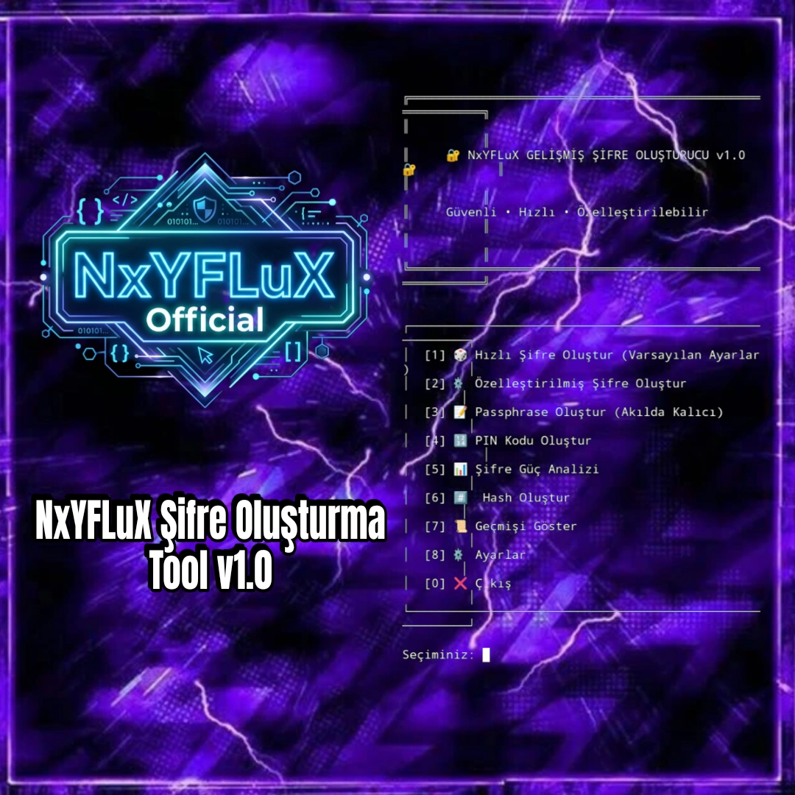

Termux için gelişmiş, güvenli ve kullanıcı dostu bir şifre oluşturma aracı.

## ✨ Özellikler

- 🎲 **Hızlı Şifre Oluşturma** - Tek tıkla güçlü şifreler
- ⚙️ **Tam Özelleştirme** - Uzunluk, karakter setleri, özel kurallar
- 📝 **Passphrase Desteği** - Akılda kalıcı kelime grupları (Diceware tarzı)
- 📊 **Entropy Analizi** - Şifre güçlülük skoru ve bit değeri
- 🔢 **PIN Kodu** - Sayısal PIN oluşturma
- #️⃣ **Hash Üretimi** - MD5, SHA1, SHA256, SHA512, Base64
- 📋 **Termux Entegrasyonu** - Panoya kopyalama desteği
- 📜 **Geçmiş** - Son 50 oluşturma kaydı
- ⚙️ **Yapılandırılabilir** - JSON tabanlı ayarlar

## 🚀 Kurulum

### 1. Termux'a Python kurun:
```bash
pkg update
pkg install python
```

### 2. Repoyu klonlayın:
```bash
cd ~
git clone https://github.com/sercanbey33/nxyflux-termux-sifre-tool.git
cd nxyflux-termux-sifre-tool
```

### 3. Çalıştırın:
```bash
python nxyfluxsifre.py
```

### 🎵 Kolay erişim için alias (isteğe bağlı):
```bash
echo 'alias sifre="python ~/nxyflux-termux-sifre-tool/nxyfluxsifre.py"' >> ~/.bashrc
source ~/.bashrc
```

Sonra sadece `sifre` yazarak çalıştırabilirsiniz!

## 📖 Kullanım

### Menü Seçenekleri:

| Seçenek | Açıklama |
|---------|----------|
| 1 | Hızlı 16 karakterli şifre |
| 2 | Özelleştirilmiş şifre (uzunluk, karakter türleri) |
| 3 | Passphrase (örn: `Kedi-Mavi-Uc-Golf`) |
| 4 | PIN kodu |
| 5 | Mevcut şifre analizi |
| 6 | Hash oluşturma |
| 7 | Geçmişi görüntüleme |
| 8 | Ayarlar |

### Örnek Şifreler:

```
🔐 Güçlü Şifre: xK9#mP2$vL5@nQ8!
📝 Passphrase: Kirmizi-Kedi-Dogu-Yedi
🔢 PIN: 7391
```

## 🔒 Güvenlik

- **Kriptografik olarak güvenli** - `random.SystemRandom()` kullanır
- **Şifreler kaydedilmez** - Sadece metadata (uzunluk, güç, tarih)
- **Offline çalışır** - İnternet bağlantısı gerekmez

## 📁 Dosyalar

```
nxyflux-termux-sifre-tool/
├── nxyfluxsifre.py
├── install.sh
├── nxyfluxsifre.jpg
├── LICENSE
├── README.md
└── .gitignore
```

## 🛠️ Gereksinimler

- Python 3.6+
- `termux-api`

---

⭐ Beğendiyseniz yıldız vermeyi unutmayın!
